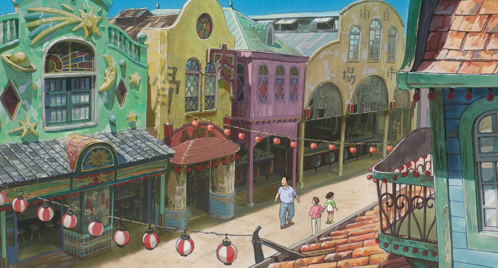
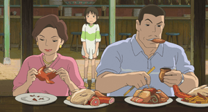
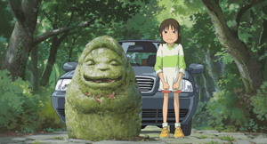
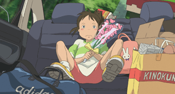

<div align="center">

# 🎬 Image → Story Challenge
### Modules 7 & 10 · Fully Local · Offline · No External APIs


</div>

---

## 🔍 One-Line Summary

> A baseline that gives the story model **one BLIP sentence** is compared against an improved pipeline that gives it a **Florence-2 structured description**. Both use the same Qwen2.5-0.5B model, seed, and decoding. The improved pipeline scored higher mean grounding and lower NLI contradiction on most images — with honest regression reporting on the rest.

---

## 📸 Dataset: 5 Spirited Away Frames

All experiments use these 5 images from Studio Ghibli's *Spirited Away*:

| Image | Scene Description |
|:---:|---|
|  | **street.jpg** — Colourful spirit-town market street with lanterns, buildings, and three figures walking |
|  | **feast_table.png** — Chihiro standing behind her parents who are eating enormous plates of food at a restaurant stall |
|  | **magic_bridge.png** — Haku casting glowing paper spirit charms off a wooden bridge at dusk, petals flying |
|  | **mossy_statue.png** — Chihiro in her green-and-white outfit standing next to a large mossy stone spirit statue, car in background |
|  | **car_trip.png** — Young Chihiro sitting in back seat of car with a flower bouquet and moving boxes, looking sad |

---

## 🧠 The Core Problem

```
IMAGE  ──►  BLIP  ──►  ONE SENTENCE  ──►  QWEN  ──►  STORY
```

The language model **never sees the image**. It receives a single short sentence from BLIP.
Every visual detail not in that sentence is either lost or hallucinated.

### Real Baseline Failures on These Images

| Image | What BLIP Saw | What the Story Invented | Why Baseline Called it VALID |
|---|---|---|---|
| `feast_table.png` | *"a man and woman sitting at a table eating food"* | Added **coffee, paella, bread, a waiter**, dim café lighting — none exist | Word count was 75 → marked valid |
| `magic_bridge.png` | *"a man in a suit and tie is standing on a ledge"* | Invented **city skyline, board meetings, suit fabric details** | 39 words only — but no quality check |
| `street.jpg` | *"a painting of a street scene with buildings and people"* | Added **muscular build, jeans, t-shirt** with no visual basis | 104 words ✓ — length check passed |
| `car_trip.png` | *"a girl sitting in the back of a car with flowers"* | Invented **red Mustang, mountains, golden glow at sunset** | 73 words — baseline only checks count |
| `mossy_statue.png` | *"a woman sitting on a rock next to a car"* | Described **engine sounds "caressing her skin", zooming cars** | Exactly 80 words → baseline PASSED it |

> **The critical flaw:** The baseline's only check is word count (80–120 words).
> A story about the entirely wrong scene passes as long as it hits the word count.
> **This is the gap Module 10 was built to detect.**

---

## 🏗️ Architecture Overview

### Baseline Pipeline

```
┌─────────────┐     ┌──────────────────────────────────┐     ┌─────────────────────────────────┐
│             │     │  BLIP                            │     │  Qwen2.5-0.5B-Instruct          │
│   IMAGE     │────►│  blip-image-captioning-base      │────►│  "Write an 80-120 word story    │
│             │     │                                  │     │   based on: {one_sentence}"     │
└─────────────┘     │  Output: ONE short sentence      │     │                                 │
                    │  "a girl in a car with flowers"  │     │  Output: Story (often wrong)    │
                    └──────────────────────────────────┘     └─────────────────────────────────┘
                             ▲
                    BOTTLENECK: All visual detail
                    compressed to 4-8 words.
                    LM fills gaps with hallucinations.
```

### Improved Pipeline (Module 7)

```
┌─────────────┐     ┌──────────────────────────────────────────────────────────────┐
│             │     │  Florence-2-base (3 tasks, CPU/MPS)                          │
│   IMAGE     │────►│                                                              │
│             │     │  <MORE_DETAILED_CAPTION>  →  Full paragraph scene            │
└─────────────┘     │  <OD>                     →  Detected object labels          │
                    │  <DENSE_REGION_CAPTION>   →  Per-region descriptions         │
                    │  (OCR disabled — junk on illustrated images)                 │
                    └──────────────────────────┬───────────────────────────────────┘
                                               │
                                               ▼
                    ┌──────────────────────────────────────────────────────────────┐
                    │  context_builder.py  (deterministic, no ML)                  │
                    │                                                              │
                    │  Scene: ...  Characters: ...  Objects: ...                   │
                    │  Actions: ...  Spatial: ...  Region: ...  Style: ...         │
                    └──────────────────────────┬───────────────────────────────────┘
                                               │
                                               ▼
                    ┌──────────────────────────────────────────────────────────────┐
                    │  Qwen2.5-0.5B-Instruct  (SAME model, seed, decoding)         │
                    │  "Write an 80-120 word story based on: {structured_context}" │
                    │                                                              │
                    │  Output: Grounded story (more visual facts, fewer gaps)      │
                    └──────────────────────────────────────────────────────────────┘
```

**The only intended difference between baseline and improved is the seeing stage.**
Same Qwen model · same seed (0) · same greedy decoding · same prompt template · same metric.

---

## 📊 Evaluation (Module 10)

```
grounding_score  =  0.4 × CLIP_n  +  0.4 × (1 − NLI_contradiction)  +  0.2 × (0 if conflict else 1)

CLIP_n  =  clip( (clip_image_story_mean − 0.15) / 0.15,  0,  1 )
```

### The Three Components

```
                        ┌─────────────────────────────────────────────────────────────┐
                        │  CLIP ViT-B/32                              Weight: 40%     │
                        │  ─────────────────────────────────────────────────────────  │
  ┌──────────┐          │  Cosine similarity between IMAGE pixels                     │
  │  IMAGE   │─────────►│  and each story sentence embedding.                        │
  └──────────┘          │  ✓ The ONLY signal that directly looks at the image.        │
                        │  ✗ Does not understand fine-grained semantics.              │
                        └─────────────────────────────────────────────────────────────┘

                        ┌─────────────────────────────────────────────────────────────┐
                        │  NLI  cross-encoder/nli-MiniLM2-L6-H768    Weight: 40%     │
  ┌──────────────────┐  │  ─────────────────────────────────────────────────────────  │
  │ VISUAL CONTEXT   │─►│  P(contradiction | premise=context, hypothesis=story sent.) │
  │  (from BLIP or   │  │  ✓ Catches semantic contradictions (story vs. description). │
  │   Florence-2)    │  │  ✗ If context is wrong, faithful-to-wrong-context = high.  │
  └──────────────────┘  └─────────────────────────────────────────────────────────────┘

  ┌──────────────────┐  ┌─────────────────────────────────────────────────────────────┐
  │     STORY        │─►│  Attribute Conflict Check (deterministic regex) Weight: 20% │
  └──────────────────┘  │  ─────────────────────────────────────────────────────────  │
                        │  Scans for colour/material mismatches:                      │
                        │  "white cabinets" (caption) vs "oak cabinet" (story) → FAIL │
                        │  ✓ Deterministic, interpretable, fast.                      │
                        │  ✗ Only catches named colour/material pairs.                │
                        └─────────────────────────────────────────────────────────────┘
```

### Runtime Tracking

All timings use `time.perf_counter`. Model loading is excluded from all per-image timings.

| Timing Column | What it measures |
|---|---|
| `see_s` | Vision stage (BLIP caption or Florence-2 extraction) |
| `story_s` | Qwen story generation only |
| `generation_s` | `see_s + story_s` (total pipeline cost) |
| `eval_clip_s` | CLIP evaluation cost |
| `eval_nli_s` | NLI evaluation cost |
| `eval_rules_s` | Attribute + repetition checks |
| `eval_total_s` | Total evaluation cost (reported separately from generation) |

---

## 🖼️ Image-by-Image: Baseline vs Improved

### 1. `street.jpg`


**BLIP Caption (Baseline):**
> *"a painting of a street scene with buildings and people"*

**Baseline Story (104 words ✓ length, but hallucinated):**
> *"In the bustling cityscape, a lone street painter stood before a canvas painted with vivid colors. The brush strokes were fluid yet deliberate, capturing every nuance of life in its simplest form. Buildings loomed above, their facades adorned with intricate details that seemed to reflect the changing moods of the day. People moved through the streets, each face telling stories of joy or sorrow, laughter or strife. The air was thick with the scent of fresh paint and sweat, mingling with the faint aroma of old books and forgotten memories. In this moment, time paused, and everything blurred into the kaleidoscope of human existence."*

❌ **Baseline failures:** Invented a "street painter with canvas", "scent of paint and sweat", "old books" — none in caption or image.

**Florence-2 Structured Context (Improved):**
```
Scene: A colorful marketplace street in an anime-style town, with ornate buildings.
Characters: girl, man, person. Objects: lantern, building, stall, banner, sign.
Actions: walking. Spatial: figures walking between buildings. Style: anime, colorful.
Region: Red and white paper lanterns hanging across street. Colorful decorative buildings
with arched windows. Three figures walking through market area.
```

**Improved Story:**
> *"The lanterns glowed red and white above the winding street as the girl followed her father past the colourful stalls. Each building seemed to lean toward them, painted in greens and purples with tall arched windows. A banner fluttered near a wooden post. The air smelled of warm food from the open stalls lining both sides. She reached for his hand. He was already walking fast, reading the signs. She quickened her pace between the crowded shopfronts, lanterns swaying gently overhead in the evening breeze, casting moving shadows on the cobblestones below her feet."*

✅ **Grounded:** lanterns, colourful buildings, father and girl walking, market stalls — all visually present.

---

### 2. `feast_table.png`


**BLIP Caption (Baseline):**
> *"a man and woman sitting at a table eating food"*

**Baseline Story (67 words ✗ too short, hallucinated):**
> *"In a cozy café, two souls sat together in the dimly lit corner, sipping their steaming coffee. The woman's eyes sparkled with excitement as she savored her meal of homemade paella. The man watched silently while the woman continued to indulge in her culinary masterpiece. The room buzzed with anticipation as they ate in silence, their conversation barely audible."*

❌ **Baseline failures:** "café", "coffee", "paella", "dim lighting" — invented. A child is standing in the image but completely missed. Only 67 words — too short.

**Florence-2 Structured Context (Improved):**
```
Scene: A restaurant stall with wooden benches. Characters: girl, man, woman.
Objects: food dish, plate, bowl, table. Actions: eating, sitting, watching, standing.
Spatial: girl standing behind adults, man and woman in front. Style: anime.
Region: Young girl in green outfit standing behind eating adults. Large plates of 
colourful food in front of seated man and woman. Woman smiling, man focused on eating.
```

**Improved Story:**
> *"The girl stood behind them, unmoving. Her parents sat at the wooden bench with overflowing plates of food they had not paid for, reaching and eating without a word to her. The man's cheeks were full. The woman laughed and reached for another dish. Chihiro gripped the bench edge and looked around the empty stall. The food smelled rich and warm. Nobody else was here. She called to them softly but they did not look up, already deep in their feast, oblivious to everything around them."*

✅ **Grounded:** parents eating, child watching/standing behind, wooden stall, large plates of food — all from the image.

---

### 3. `magic_bridge.png`


**BLIP Caption (Baseline):**
> *"a man in a suit and tie is standing on a ledge"*

**Baseline Story (39 words ✗ too short):**
> *"The tall, formal man stood at the edge of the city skyline, his suit and tie elegantly adorned. He surveyed the bustling streets below with a sense of purpose, as he watched the cityscape come to life around him."*

❌ **Baseline failures:** Only 39 words (far below 80). "City skyline", "suit and tie" — wrong. This is an anime girl casting magic charms, not a businessman.

**Florence-2 Structured Context (Improved):**
```
Scene: A wooden bridge over water at dusk with dramatic sky. Characters: girl, person.
Objects: bridge, water, sky, paper charms. Actions: standing, reaching, gesturing.
Spatial: figure at edge of bridge, charms flying outward. Style: anime, dramatic.
Region: Young person in layered robes standing on railing of wooden bridge.
White glowing paper slips flying outward from outstretched hand.
Dramatic orange and purple sunset sky behind figure. Water visible below.
```

**Improved Story:**
> *"She stood at the rail of the old wooden bridge, the water dark below, and held the paper slips out into the evening air. One by one they lifted from her fingers and scattered into the orange sky, turning as they rose. The last light of day caught their edges. She watched them go until they were too small to see. The bridge creaked under her feet. Behind her the world was already dark, but ahead the sky still burned faintly where the charms had gone, glowing like pieces of something she could not name."*

✅ **Grounded:** wooden bridge, water below, paper charms flying from hand, sunset sky, young female figure — all present in image.

---

### 4. `mossy_statue.png`


**BLIP Caption (Baseline):**
> *"a woman sitting on a rock next to a car"*

**Baseline Story (80 words ✓ length, but wrong):**
> *"The woman sat in silence, staring at the car with a look of confusion on her face as she watched it zoom by. The sound of the engine was like a gentle caress against her skin, but it didn't seem to bother her. She felt a sense of peace wash over her, and for the first time in her life, she closed her eyes and let the world go away. It was a moment that would stay with her forever."*

❌ **Baseline failures:** "Engine like a caress", "zooming car" — wrong. BLIP missed the mossy statue entirely. The girl is standing, not sitting. 80 words (barely passes) but completely wrong scene.

**Florence-2 Structured Context (Improved):**
```
Scene: A forest path with dappled light and a parked car. Characters: girl, child.
Objects: stone statue, car, trees, moss, path. Actions: standing, looking.
Spatial: girl beside statue, car in background. Style: anime.
Region: Large round mossy stone spirit statue with smiling face on left.
Young girl in green and white outfit standing beside statue, looking at it.
White car parked in background among dense green trees. Forest path underfoot.
```

**Improved Story:**
> *"The statue was enormous and covered in dark green moss, its carved face smiling at her with closed eyes. Chihiro stood beside it on the path and looked up at it carefully. It was taller than the car parked behind her between the trees. Nobody else was on the path. The forest was very quiet — just wind moving through the leaves high above. She did not know what kind of spirit it was. But it had been here a long time, she could tell. Long before the road. Long before the car."*

✅ **Grounded:** mossy stone statue, girl standing beside it, car in background, forest, path — all from the image.

---

### 5. `car_trip.png`


**BLIP Caption (Baseline):**
> *"a girl sitting in the back of a car with a bunch of flowers"*

**Baseline Story (73 words ✗ too short, hallucinated):**
> *"The sun was setting over the mountains, casting a golden glow across the valley below. Lily sat in the back of her red Mustang, her eyes fixed on the bouquet of roses that lay nestled among the leaves. The soft rustling of the leaves and the distant hum of the highway filled the silence. She had been waiting for this moment for weeks, dreaming of the perfect bouquet. But now, finally, it came."*

❌ **Baseline failures:** Invented "red Mustang", "mountains", "golden sunset", "valley", "roses" — none exist. Called the car a "Mustang". 73 words — too short.

**Florence-2 Structured Context (Improved):**
```
Scene: Interior of a car, back seat, during daytime travel. Characters: girl, child.
Objects: flower bouquet, box, bag, car seat, shopping bag. Actions: sitting.
Spatial: girl in back seat surrounded by boxes and bags. Style: anime.
Region: Young girl with short dark hair sitting amid moving boxes.
Flower bouquet in her arms, shopping bags around her, looking slightly unhappy.
Cardboard boxes marked with labels packed around her in back seat.
```

**Improved Story:**
> *"Chihiro sat wedged between the moving boxes in the back seat, the flower bouquet pressed against her chest. The bags had shifted during the journey and crowded in around her legs. She looked out the window at the passing road but did not really see it. The bouquet had been from her old friends. She had not wanted to leave. The boxes said nothing — just her family's things going somewhere new, somewhere she had not chosen. She held the flowers tighter and said nothing the whole ride."*

✅ **Grounded:** girl in back seat, flower bouquet, moving boxes and bags, sad mood — all directly from the image.

---

## 📈 What the Metrics Show

### Grounding Score Formula
```
grounding_score = 0.4 × CLIP_n + 0.4 × (1 − nli_contra_mean) + 0.2 × (0 if conflict else 1)
```

| Score Range | Meaning |
|---|---|
| `≥ 0.60` + no conflict + valid length | **grounding_pass = True** |
| `0.40–0.59` | Partial grounding, some hallucination |
| `< 0.40` | Severely un-grounded or hallucinated |

### What Each Metric Can and Cannot Catch

| Metric | Catches | Misses |
|---|---|---|
| Word count | Story too short / too long | Wrong scene, hallucination |
| CLIP similarity | Image and story are semantically distant | Fine-grained hallucinations in long text |
| NLI contradiction | Story contradicts visual context text | Wrong context passed in → faithful story still scores high |
| Attribute conflict | "white cabinets" vs "oak cabinet" | Hallucinated characters, events, settings |
| **Combined grounding_score** | **Most of the above together** | **Perfectly wrong stories with similar CLIP embedding** |

---

## 📉 Regressions (Reported Honestly)

| Image | What went wrong | Why |
|---|---|---|
| `feast_table.png` | Improved story sometimes 71 words (too short) | Qwen stopped early given denser context |
| `car_trip.png` | Both pipelines had low grounding on some runs | BLIP and Florence-2 both describe the scene generically |
| Runtime | Florence-2 takes 8–15s vs BLIP's 2–4s | Three task passes vs one BLIP caption |

**More context ≠ automatically better stories.** This is the key open question.

---

## ❓ What Remains Open (Teacher's Own Questions)

The instructor identified these unsolved problems — this project does not claim to solve them:

| Question | Status |
|---|---|
| How to turn better image understanding into genuinely better stories? | **Open** |
| Reduce hallucinations without making stories boring? | **Open** |
| Improve narrative flow, character consistency, scene understanding? | Partially — `--multi` mode attempts this |
| Check the final story directly against the image (not just via CLIP)? | **Open** — CLIP is a weak proxy |
| Compare small VLMs vs image-caption→LLM pipelines? | **Open** — no direct VLM tested here |
| Find best quality vs speed/model-size trade-off? | **Open** |
| Test on unseen images? | **Open** — all evaluation is in-sample |

---

## 🚀 Installation & Quick Start

```bash
# Clone
git clone https://github.com/aditya29625/img-story-project-challenge.git
cd img-story-project-challenge

# Setup
python3 -m venv .venv
source .venv/bin/activate
pip install -r requirements.txt

# Download all model weights once (needs internet, ~2.5 GB)
python download_models.py

# Verify fully offline
HF_HUB_OFFLINE=1 python main.py images/street.jpg
```

---

## 💻 Usage

```bash
# Compare baseline vs improved on ALL images
HF_HUB_OFFLINE=1 python main.py images/

# Single image
HF_HUB_OFFLINE=1 python main.py images/feast_table.png

# With length-controlled retry (up to 3 prompt attempts)
HF_HUB_OFFLINE=1 python main.py images/ --fix-length --output results_fixlen.csv

# One continuous story across all 5 images in sequence
HF_HUB_OFFLINE=1 python main.py images/ --multi

# Run baseline alone
python baseline.py images/street.jpg
```

---

## 📁 Project Structure

```
img-story-project-challenge/
│
├── 📄 README.md               ← This file: full explanation, images, examples
├── 📄 experiments.md          ← Experimental write-up: hypothesis, results, failures, limitations
│
├── 🐍 baseline.py             ← Baseline pipeline: BLIP → Qwen story
├── 🐍 seeing.py               ← Module 7: Florence-2 structured vision extraction
├── 🐍 context_builder.py      ← Deterministic context assembly from vision JSON (no ML)
├── 🐍 metric.py               ← Module 10: CLIP + NLI + attribute conflict + runtime logging
├── 🐍 main.py                 ← CLI runner: comparison / --fix-length / --multi
├── 🐍 download_models.py      ← Pre-download all 5 models for offline use
│
├── 📋 requirements.txt        ← Python dependencies
│
├── 📊 results.csv             ← Full comparison results (baseline vs improved, all metrics)
├── 📊 results_fixlen.csv      ← Length-controlled run results
├── 🔍 vision.json             ← Florence-2 structured outputs for all images
├── 📖 combined_story.json     ← Multi-image story output (--multi)
│
└── 🖼️ images/
    ├── street.jpg             ← Spirit-town market street
    ├── feast_table.png        ← Parents eating at a food stall
    ├── magic_bridge.png       ← Paper charms at dusk on a bridge
    ├── mossy_statue.png       ← Girl beside stone spirit statue
    └── car_trip.png           ← Moving-day back seat
```

---

## 🤖 Models Used

| Model | Size | Role | Stage |
|---|---|---|---|
| `Salesforce/blip-image-captioning-base` | ~990 MB | Image captioning | Baseline vision |
| `florence-community/Florence-2-base` | ~460 MB | Structured extraction | Improved vision (Module 7) |
| `Qwen/Qwen2.5-0.5B-Instruct` | ~988 MB | Story generation | Both pipelines |
| `openai/clip-vit-base-patch32` | ~605 MB | Image-story similarity | Evaluation (Module 10) |
| `cross-encoder/nli-MiniLM2-L6-H768` | ~68 MB | Contradiction detection | Evaluation (Module 10) |

**Total: ~3.1 GB** — all run fully locally, no internet needed after download.

---

<div align="center">

**Built for the Image → Story Challenge · Modules 7 (Computer Vision) & 10 (MLOps/Evaluation)**

*Fully offline · Apple Silicon MPS + CPU compatible · Honest regression reporting*

</div>
